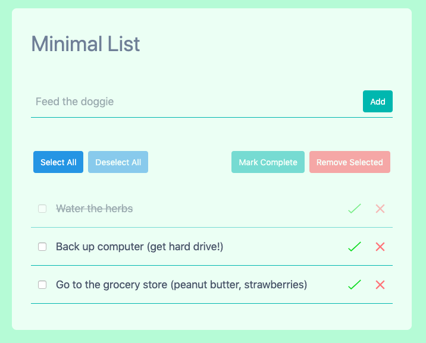

# MinimalList

MinimalList is a basic Todo List app with the following features: 

  * basic **add/remove/edit/mark complete** operations
  * **bulk operation** buttons that will dynamically disable based off List state
  * **local persistence** via localStorage API - coming back to the app using the same browser will reload the same List state as when you left

[**CHECK OUT THE LIVE DEMO**](https://kxu.io/projects/2019_07/MinimalList)

My background is in back-end development, so the goal of this project was to get a feel for front-end development. In addition, I gave myself **1 week** to work on this since projects like these can easily take up as much time as you give them.

MinimalList was built using **vanilla JS** and styled with [**Tailwind CSS**](https://tailwindcss.com). 

## Development Timeline

**Date: 7/9 - 7/16**

CSS was the biggest mental hurdle for me, so in the initial version I went straight into the JS and got some basic functionality with plain JS. 

I used **Bootstrap** for the next version and refactored the JS into a more OOP-style. However, as I made more progress, I realized that Bootstrap was too high-level in terms of abstracting away CSS fundamentals and moved to **Tailwind**, a low-level utility based CSS framework, which allowed me more control of individual layout and styles and forced me to understand the underlying CSS properties in depth. 

## If I had more time...
 
#### **refactor the JS**

I used “private” methods (via _underscore notation) to control things like List state, but because those methods are still publicly accessible I found that I would call them directly in order to get some quick workarounds. In subsequent projects I want to experiment with private methods that prevent some of this leaky abstraction (method definitions in the constructor, Symbols, etc.)

#### Unit/DOM Tests

Unit tests are particularly well-suited for testing the internal state of JS objects like these. All CRUD operations are easily tested by running the operation on the JS object (ex. TodoList.addListItem()) and then validating that the internal List Item struct is properly marked.

In addition to Unit Tests, I also considered adding DOM tests since a lot of the List functionality on the frnot-end happens through JS injection (when a new List Item gets added, the corresponding HTML is generated using JS and tacked onto the parent Unordered List element. 

#### **reduce the  CSS**

This point is two-fold, both relating to the Tailwind framework operates: 

The first angle is to reduce the number of inline Tailwind classes in the HTML by extracting shared CSS components into shared components. For example, all of the buttons in the Bulk Actions bar are styled similary except background and hover colors, so all of the shared classes can be abstracted into a specific class. This is no different from refactoring traditional CSS, but [Tailwind uses special CSS “directives”](https://tailwindcss.com/docs/extracting-components#extracting-css-components-with-apply) that require going through a build process to essentially pre-process and expand those CSS classes.

The second angle is to reduce the final CSS footprint by removing all the unused CSS classes. Tailwind generates thousands of CSS classes - “p-1” applies “padding: 0.25rem”, “bg-green-100” applies "background-color:  #f0fff4 ”, etc. Although this makes styling extremely accessible during development, it has the downside of generating thousands of classes that are ultimately unused. There are ways of [reducing this footprint by configuring](https://tailwindcss.com/docs/controlling-file-size) and purging (PurgeCSS) any unused classes, but that also requires running a build so I chose to ignore it and use the minified version. 

